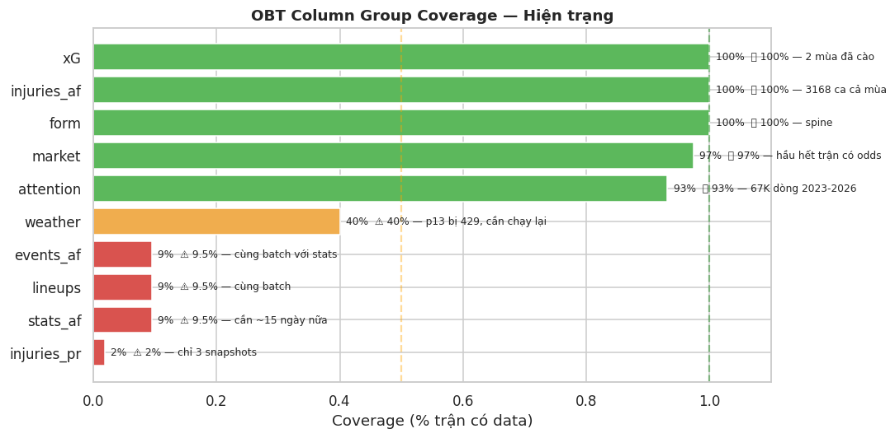
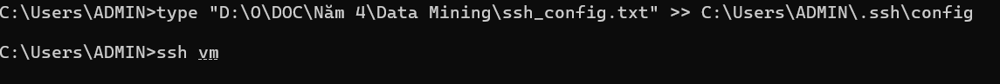

## đầu tiên ae đọc khám phá data hiện trạng của silver nhé:

- file này: `football-lake\notebooks\ipynb\OBT\silver_inventory_eda.ipynb`

- đọc các kết quả sẽ cho chúng ta biết được các góc nhìn toàn cảnh của silver hiện tại sau khi thu thập từ nhiều nguồn khác nhau. Từ đó nảy sinh ra nhiều vấn đề mà ae có thể thấy trong quá trình chạy file trên ví dụ:

### kết quả (Bảng, Join Key, Tình trạng, Ghi chú)
<style type="text/css">
#T_c4100_row0_col2, #T_c4100_row1_col2, #T_c4100_row3_col2, #T_c4100_row7_col2, #T_c4100_row8_col2, #T_c4100_row9_col2, #T_c4100_row10_col2, #T_c4100_row11_col2, #T_c4100_row12_col2, #T_c4100_row13_col2, #T_c4100_row14_col2, #T_c4100_row15_col2, #T_c4100_row18_col2 {
  background: #d4edda;
}
#T_c4100_row2_col2, #T_c4100_row4_col2, #T_c4100_row5_col2, #T_c4100_row6_col2, #T_c4100_row16_col2, #T_c4100_row17_col2, #T_c4100_row19_col2, #T_c4100_row20_col2 {
  background: #fff3cd;
}
</style>
<table id="T_c4100" class="dataframe">
  <thead>
    <tr>
      <th class="blank level0" >&nbsp;</th>
      <th id="T_c4100_level0_col0" class="col_heading level0 col0" >Silver Table</th>
      <th id="T_c4100_level0_col1" class="col_heading level0 col1" >Join Key</th>
      <th id="T_c4100_level0_col2" class="col_heading level0 col2" >Status</th>
      <th id="T_c4100_level0_col3" class="col_heading level0 col3" >Ghi chú</th>
    </tr>
  </thead>
  <tbody>
    <tr>
      <th id="T_c4100_level0_row0" class="row_heading level0 row0" >0</th>
      <td id="T_c4100_row0_col0" class="data row0 col0" >fd_matches</td>
      <td id="T_c4100_row0_col1" class="data row0 col1" >match_id</td>
      <td id="T_c4100_row0_col2" class="data row0 col2" >✅ Ready</td>
      <td id="T_c4100_row0_col3" class="data row0 col3" >Spine — 760 trận 2024-26</td>
    </tr>
    <tr>
      <th id="T_c4100_level0_row1" class="row_heading level0 row1" >1</th>
      <td id="T_c4100_row1_col0" class="data row1 col0" >fd_odds</td>
      <td id="T_c4100_row1_col1" class="data row1 col1" >match_id</td>
      <td id="T_c4100_row1_col2" class="data row1 col2" >✅ Ready</td>
      <td id="T_c4100_row1_col3" class="data row1 col3" >Odds 1X2 lịch sử đầy đủ</td>
    </tr>
    <tr>
      <th id="T_c4100_level0_row2" class="row_heading level0 row2" >2</th>
      <td id="T_c4100_row2_col0" class="data row2 col0" >fd_matches_weather</td>
      <td id="T_c4100_row2_col1" class="data row2 col1" >match_id</td>
      <td id="T_c4100_row2_col2" class="data row2 col2" >⚠️ Partial</td>
      <td id="T_c4100_row2_col3" class="data row2 col3" >p13 chưa phủ đủ sân (429 error)</td>
    </tr>
    <tr>
      <th id="T_c4100_level0_row3" class="row_heading level0 row3" >3</th>
      <td id="T_c4100_row3_col0" class="data row3 col0" >af_fixtures</td>
      <td id="T_c4100_row3_col1" class="data row3 col1" >bridge fixture_id</td>
      <td id="T_c4100_row3_col2" class="data row3 col2" >✅ Ready</td>
      <td id="T_c4100_row3_col3" class="data row3 col3" >380 trận EPL 2024</td>
    </tr>
    <tr>
      <th id="T_c4100_level0_row4" class="row_heading level0 row4" >4</th>
      <td id="T_c4100_row4_col0" class="data row4 col0" >af_match_stats</td>
      <td id="T_c4100_row4_col1" class="data row4 col1" >bridge fixture_id</td>
      <td id="T_c4100_row4_col2" class="data row4 col2" >⚠️ Partial</td>
      <td id="T_c4100_row4_col3" class="data row4 col3" >Mới có 72/380 trận (p24 đang cào)</td>
    </tr>
    <tr>
      <th id="T_c4100_level0_row5" class="row_heading level0 row5" >5</th>
      <td id="T_c4100_row5_col0" class="data row5 col0" >af_match_events</td>
      <td id="T_c4100_row5_col1" class="data row5 col1" >bridge fixture_id</td>
      <td id="T_c4100_row5_col2" class="data row5 col2" >⚠️ Partial</td>
      <td id="T_c4100_row5_col3" class="data row5 col3" >Mới có 72/380 trận</td>
    </tr>
    <tr>
      <th id="T_c4100_level0_row6" class="row_heading level0 row6" >6</th>
      <td id="T_c4100_row6_col0" class="data row6 col0" >af_lineups</td>
      <td id="T_c4100_row6_col1" class="data row6 col1" >bridge fixture_id</td>
      <td id="T_c4100_row6_col2" class="data row6 col2" >⚠️ Partial</td>
      <td id="T_c4100_row6_col3" class="data row6 col3" >Mới có 72/380 trận</td>
    </tr>
    <tr>
      <th id="T_c4100_level0_row7" class="row_heading level0 row7" >7</th>
      <td id="T_c4100_row7_col0" class="data row7 col0" >understat_team_xg</td>
      <td id="T_c4100_row7_col1" class="data row7 col1" >(team_key, match_date)</td>
      <td id="T_c4100_row7_col2" class="data row7 col2" >✅ Ready</td>
      <td id="T_c4100_row7_col3" class="data row7 col3" >6 giải × 2 mùa (2024+2025)</td>
    </tr>
    <tr>
      <th id="T_c4100_level0_row8" class="row_heading level0 row8" >8</th>
      <td id="T_c4100_row8_col0" class="data row8 col0" >understat_match_xg</td>
      <td id="T_c4100_row8_col1" class="data row8 col1" >(team_key, match_date)</td>
      <td id="T_c4100_row8_col2" class="data row8 col2" >✅ Ready</td>
      <td id="T_c4100_row8_col3" class="data row8 col3" >xG per trận</td>
    </tr>
    <tr>
      <th id="T_c4100_level0_row9" class="row_heading level0 row9" >9</th>
      <td id="T_c4100_row9_col0" class="data row9 col0" >understat_shots</td>
      <td id="T_c4100_row9_col1" class="data row9 col1" >(league, match_id)</td>
      <td id="T_c4100_row9_col2" class="data row9 col2" >✅ Ready</td>
      <td id="T_c4100_row9_col3" class="data row9 col3" >Shot coords 6 giải</td>
    </tr>
    <tr>
      <th id="T_c4100_level0_row10" class="row_heading level0 row10" >10</th>
      <td id="T_c4100_row10_col0" class="data row10 col0" >af_players</td>
      <td id="T_c4100_row10_col1" class="data row10 col1" >player_id</td>
      <td id="T_c4100_row10_col2" class="data row10 col2" >✅ Ready</td>
      <td id="T_c4100_row10_col3" class="data row10 col3" >40 players profile</td>
    </tr>
    <tr>
      <th id="T_c4100_level0_row11" class="row_heading level0 row11" >11</th>
      <td id="T_c4100_row11_col0" class="data row11 col0" >af_injuries</td>
      <td id="T_c4100_row11_col1" class="data row11 col1" >(team_key, season)</td>
      <td id="T_c4100_row11_col2" class="data row11 col2" >✅ Ready</td>
      <td id="T_c4100_row11_col3" class="data row11 col3" >3168 ca chấn thương EPL 2024</td>
    </tr>
    <tr>
      <th id="T_c4100_level0_row12" class="row_heading level0 row12" >12</th>
      <td id="T_c4100_row12_col0" class="data row12 col0" >understat_player_xg</td>
      <td id="T_c4100_row12_col1" class="data row12 col1" >(player_name, league)</td>
      <td id="T_c4100_row12_col2" class="data row12 col2" >✅ Ready</td>
      <td id="T_c4100_row12_col3" class="data row12 col3" >xG stats cầu thủ</td>
    </tr>
    <tr>
      <th id="T_c4100_level0_row13" class="row_heading level0 row13" >13</th>
      <td id="T_c4100_row13_col0" class="data row13 col0" >wd_stadiums</td>
      <td id="T_c4100_row13_col1" class="data row13 col1" >team_key (venue)</td>
      <td id="T_c4100_row13_col2" class="data row13 col2" >✅ Ready</td>
      <td id="T_c4100_row13_col3" class="data row13 col3" >Tọa độ sân, sức chứa</td>
    </tr>
    <tr>
      <th id="T_c4100_level0_row14" class="row_heading level0 row14" >14</th>
      <td id="T_c4100_row14_col0" class="data row14 col0" >tsdb_teams</td>
      <td id="T_c4100_row14_col1" class="data row14 col1" >team_key</td>
      <td id="T_c4100_row14_col2" class="data row14 col2" >✅ Ready</td>
      <td id="T_c4100_row14_col3" class="data row14 col3" >Logo, metadata đội</td>
    </tr>
    <tr>
      <th id="T_c4100_level0_row15" class="row_heading level0 row15" >15</th>
      <td id="T_c4100_row15_col0" class="data row15 col0" >af_standings</td>
      <td id="T_c4100_row15_col1" class="data row15 col1" >(team_key, season)</td>
      <td id="T_c4100_row15_col2" class="data row15 col2" >✅ Ready</td>
      <td id="T_c4100_row15_col3" class="data row15 col3" >BXH cuối mùa</td>
    </tr>
    <tr>
      <th id="T_c4100_level0_row16" class="row_heading level0 row16" >16</th>
      <td id="T_c4100_row16_col0" class="data row16 col0" >odds_h2h / spreads</td>
      <td id="T_c4100_row16_col1" class="data row16 col1" >(home_key,away_key,date)</td>
      <td id="T_c4100_row16_col2" class="data row16 col2" >⚠️ Future</td>
      <td id="T_c4100_row16_col3" class="data row16 col3" >Chỉ có upcoming, không có lịch sử</td>
    </tr>
    <tr>
      <th id="T_c4100_level0_row17" class="row_heading level0 row17" >17</th>
      <td id="T_c4100_row17_col0" class="data row17 col0" >google_news_articles</td>
      <td id="T_c4100_row17_col1" class="data row17 col1" >(team_key, date window)</td>
      <td id="T_c4100_row17_col2" class="data row17 col2" >⚠️ Limited</td>
      <td id="T_c4100_row17_col3" class="data row17 col3" >Cần rolling aggregation</td>
    </tr>
    <tr>
      <th id="T_c4100_level0_row18" class="row_heading level0 row18" >18</th>
      <td id="T_c4100_row18_col0" class="data row18 col0" >wm_pageviews</td>
      <td id="T_c4100_row18_col1" class="data row18 col1" >(team_key, date)</td>
      <td id="T_c4100_row18_col2" class="data row18 col2" >✅ Ready</td>
      <td id="T_c4100_row18_col3" class="data row18 col3" >67K dòng 2023–2026</td>
    </tr>
    <tr>
      <th id="T_c4100_level0_row19" class="row_heading level0 row19" >19</th>
      <td id="T_c4100_row19_col0" class="data row19 col0" >youtube_comments</td>
      <td id="T_c4100_row19_col1" class="data row19 col1" >(query, date)</td>
      <td id="T_c4100_row19_col2" class="data row19 col2" >⚠️ Limited</td>
      <td id="T_c4100_row19_col3" class="data row19 col3" >Chưa join được trực tiếp</td>
    </tr>
    <tr>
      <th id="T_c4100_level0_row20" class="row_heading level0 row20" >20</th>
      <td id="T_c4100_row20_col0" class="data row20 col0" >pr_player_injuries</td>
      <td id="T_c4100_row20_col1" class="data row20 col1" >(team_key, ASOF date)</td>
      <td id="T_c4100_row20_col2" class="data row20 col2" >⚠️ Partial</td>
      <td id="T_c4100_row20_col3" class="data row20 col3" >Chỉ 3 snapshots</td>
    </tr>
  </tbody>
</table>

có thể thấy không phải bảng nào cũng có hiện trạng tốt => nên sẽ có các kịch bản xử lý khác nhau. Ví dụ:
- bảng af_match_stats, af_match_events, af_lineups: hiện tại chỉ có 72/380 trận => ta sẽ đợi (chờ) cho đến khi pipeline thu thập được dữ liệu của 360 trận remaining. Sau đó ta sẽ tiến hành join 3 bảng này lại với nhau và đẩy xuống silver.
- bảng fd_matches_weather: hiện tại mới chỉ có 304/760 trận => ta sẽ đợi (chờ) cho đến khi pipeline thu thập được dữ liệu của 456 trận remaining. Sau đó ta sẽ tiến hành join với fd_matches và đẩy xuống silver.
- các bảng sau khi cào từ source về 

- vấn đề tiếp theo là nguồn Text (không có join key trực tiếp), ta cần phải có một cột trung gian để join 2 bảng này với fd_matches (ví dụ match_date & home/away name). Từ đó ta mới có thể join 2 bảng này với nhau và đẩy xuống silver. hoặc phải bỏ qua và tìm hướng tiếp cận mới để làm sau

> Với 3 nguồn text chính: Google News, YouTube Comments, Wikipedia Pageviews — chúng không có match_id, không join được trực tiếp vào OBT grain trận đấu. Có 3 cách tiếp cận:
1.  Pre-aggregate thành mart_team_sentiment
2. Rolling aggregation trực tiếp trong build_obt_match.py
3. Sử dụng một lookup trung gian (ví dụ: df_match_lookup_id) ghép từ metadata API và các nguồn khác (như Transfermarkt) để nhân bản match_id vào các bảng text.
4.  NLP pipeline riêng → mart_team_nlp

> tóm lại ae có thể bỏ qua các nguồn này: `google_news_articles`, `youtube_comments`, `wikipedia_pageviews`, `wm_pageviews` — vì chúng không có match_id, không join được trực tiếp vào OBT grain trận đấu. 

### vấn đề tiếp theo là độ phủ các cột trong obt cái này có thể ko quan trọng nhưng nếu gặp thì join bảng sẽ trả nhiều kết quả ko mong muốn


> dựa vào hình trên được lấy từ kết quả chạy file ipynb có vài bảng có độ phủ cao tức là có nhiều dữ liệu còn lại khi độ phủ thấp đồng nghĩa việc ae join các bảng lại sẽ có nhiều giá trị rỗng nên mất data đây là vấn đề thêm data nên có thể khắc phục bằng chạy thêm thu thập dữ liệu


## cách làm 

từ các kết quả chạy của EDA (khám phá data silver) ở ipynb nhá ae có tư duy thì lên kế hoạch join các bảng lại với nhau thành OBT (One Big Table) về match (Đăng), player (Vượng) mỗi domain sẽ cho chiến lược join riêng.

có thể dùng đầu kết hợp với AI LLM bằng cách bạn gửi cả file `silver_inventory_eda.ipynb` đó lên cho ai xem kết quả để hiểu ngữ cảnh và lập chiến lược build thành bảng OBT của mình kèm theo file md này bạn đang đọc.

### code

- đầu tiên tôi sẽ tạo nhánh mới là `obt` bạn fetch, pull lại và checkout ra nhánh mới này nhé

- sau đó viết code của bạn vào đây `football-lake\notebooks\python\obt`
- ngoài ra có thể dùng code tiện ích này nhé `football-lake\notebooks\python\utils\lake_utils.py` nếu bỏ lên ai bảo nó có thể tận dụng tiện ích này hoặc có thể code thêm, code lại từ đầu

### về ssh vào vm thì như sau

`ssh_config.txt` bạn copy ra máy bạn nhé chỗ nào trước để key vm đó

nội dung:
```
# SSH Config cho Azure VM Data
# type "D:\O\DOC\Năm 4\Data Mining\ssh_config.txt" >> C:\Users\ADMIN\.ssh\config
# Usage: ssh vm

Host vm
    HostName 20.41.113.183
    User azureuser
    IdentityFile C:\Users\ADMIN\.ssh\RIPT.pem
    # Port forwarding: truy cập từ laptop
    LocalForward 3000 localhost:3000
    LocalForward 8080 localhost:8080
    LocalForward 9000 localhost:9000
    LocalForward 9001 localhost:9001
    LocalForward 5432 localhost:54321
    LocalForward 15672 localhost:15672
    ServerAliveInterval 60
    ServerAliveCountMax 3
    StrictHostKeyChecking no

```
sau đó sửa các cái sau
- `IdentityFile C:\Users\ADMIN\.ssh\RIPT.pem` <<<<< chỗ này sửa đường dẫn key bạn đang để và tên của nó phù hợp

- sửa xong lưu file và chạy như sau:
`type "D:\O\DOC\Năm 4\Data Mining\ssh_config.txt" >> C:\Users\ADMIN\.ssh\config`

> D:\O\DOC\Năm 4\Data Mining\ssh_config.txt <<<<< đường dẫn file config ssh của tôi bạn sửa lại nhá

sửa khó thì bảo AI nó làm cho

- sau đó chạy lệnh `ssh vm` trên cmd là được nhớ chạy `type "D:\O\DOC\Năm 4\Data Mining\ssh_config.txt" >> C:\Users\ADMIN\.ssh\config` trước và sửa đúng với máy bạn


hôm nào tôi ko mở vm bạn báo nhá rồi `git push origin obt` lên github vào vm chỉ cần `git pull` là đc (có thể nhờ AI ssh vào vm làm đc luôn đó nhưng cẩn thận nó phá)

chạy python code bạn trên đó cũng đc chạy thử rồi fix bug (có thể nhờ AI)