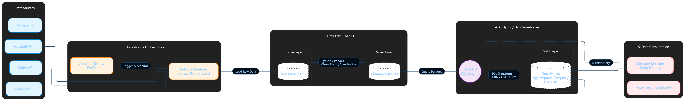

# Sơ đồ Kiến trúc Dữ liệu Tổng quan (Data Architecture)

Dưới đây là sơ đồ kiến trúc hệ thống dữ liệu cho dự án Data Mining của bạn. Sơ đồ được chia thành 5 phân vùng (segment) rõ ràng, đi từ nguồn dữ liệu thô cho đến lúc phục vụ người dùng cuối.

---

## Chi tiết các Phân vùng (Segments)

### 1. Data Sources (Nguồn dữ liệu)
Nơi khởi nguồn của dữ liệu. Theo context project của bạn, vùng này bao gồm các API (Odds API, Football API) và các nguồn thu thập dạng text/web scraping (Wikipedia, Google News).

### 2. Data Ingestion & Orchestration (Thu thập & Điều phối)
*   **Apache Airflow:** Đóng vai trò là nhạc trưởng (Orchestrator). Airflow sẽ chạy các DAGs (như `dag_p22_odds_api.py`, `dag_p10_wikimedia.py`) theo lịch trình.
*   **Python Pipelines:** Chịu trách nhiệm thực thi việc gọi API, kéo dữ liệu về (Extract).

### 3. Data Lake (Lưu trữ tập trung - MinIO)
Đóng vai trò là trái tim lưu trữ dữ liệu với chi phí rẻ, khả năng mở rộng cao.
*   **Bronze Layer:** Nơi Python đổ dữ liệu thô (Raw) vừa kéo từ nguồn về. Dữ liệu thường giữ nguyên định dạng gốc như `JSON` hoặc `CSV` để không làm mất thông tin.
*   **Silver Layer:** Dữ liệu từ Bronze được Python/Pandas xử lý sơ bộ (làm sạch null, chuẩn hóa kiểu dữ liệu date/time) và lưu lại dưới định dạng **Parquet**. Định dạng Parquet giúp nén tốt và tối ưu hóa việc đọc dữ liệu dạng cột.

### 4. Data Warehouse (Lớp phân tích - DuckDB)
Đây là nơi áp dụng phương pháp **Hybrid ELT**.
*   **DuckDB Engine:** Thay vì load dữ liệu vào một database cồng kềnh, DuckDB sẽ đọc (query) TRỰC TIẾP các file Parquet từ lớp Silver trên MinIO.
*   **Gold Layer:** DuckDB sử dụng câu lệnh SQL siêu tốc độ để thực hiện các phép Join, Group By tạo ra các bảng tổng hợp (Data Marts) phục vụ cho từng mục đích nghiệp vụ cụ thể. Kết quả này được lưu trữ ở lớp Gold (có thể là file `.duckdb` hoặc các file Parquet đã tổng hợp).

### 5. Data Consumption (Khai thác dữ liệu)
Lớp phục vụ người dùng cuối và các hệ thống khác.
*   **Machine Learning / Data Mining:** Các Data Scientist sử dụng Jupyter Notebook kết nối vào lớp Gold hoặc dùng DuckDB query thẳng từ Silver/Gold để train model dự đoán kết quả bóng đá.
*   **BI (Business Intelligence):** Các công cụ như Power BI, Tableau kết nối vào lớp Gold để vẽ biểu đồ, dashboard báo cáo trực quan.
